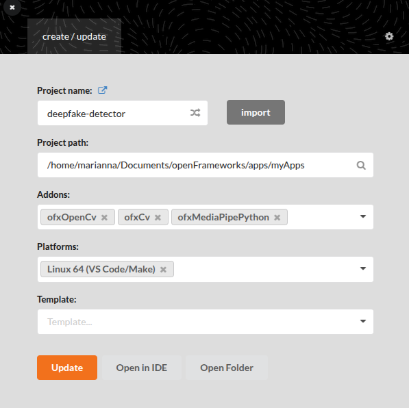

# Deepfake Detector

Real-time deepfake / authenticity detection using openFrameworks, MediaPipe and OpenCV. Tracks faces via a 468-point face mesh and runs multiple signal analyzers in parallel to produce an authenticity score.

Detection algorithms are heuristic and not trained on a labelled dataset. Their basis and behaviour derive from scientific research.

---

## How It Works

Each frame, the app detects faces and runs four independent analyzers. Their scores are combined into a smoothed weighted composite authenticity score shown in the sidebar.

### Blink Analysis (`BlinkAnalyzer`)

Real people blink ~12–25 times per minute with irregular gaps. Deepfakes and photos typically don't blink at all, or blink with unnatural regularity.

**What it measures:** Eye Aspect Ratio (EAR) using 6 MediaPipe landmarks per eye. A blink is detected when EAR drops below 0.21 for at least 2 frames.

**Scoring:**
- Blink rate outside 8–40 BPM → lower score
- Blink gaps with low coefficient of variation (< 0.15, i.e. metronomic) → lower score
- Weighted 60% rate, 40% regularity

### Landmark Jitter Analysis (`JitterAnalyzer`)

Real head movement produces natural, irregular micro-motion. Deepfakes can appear frozen, or exhibit unnatural frame-to-frame jumps from unstable warping.

**What it measures:** Frame-to-frame acceleration of the nose tip landmark (point 4), normalized by interocular distance (IOD) to be scale-independent, over a 30-frame rolling window.

**Scoring:**
- Very low variance (< 0.00001) → frozen / AI temporal smoothing, lower score
- Very high variance (> 0.02) → flickering artifact, lower score
- Large single jump (> 0.5 normalized) → teleport artifact, lower score
- Weighted 60% variance, 40% max jump

### FFT Spatial Analysis (`FFTAnalyzer`)

GAN-generated faces can leave artifacts in the frequency domain — upsampling via transposed convolutions produces checkerboard patterns that appear as elevated high-frequency energy.

**What it measures:** Ratio of high-frequency energy (40–100% of the Nyquist radius) to total energy in the log magnitude spectrum of the face crop.

**Scoring:**
- Ratio 0.55–0.72 → natural roll-off, authentic
- Ratio > 0.72 → elevated high-frequency energy, suspicious
- Ratio < 0.45 → over-smoothed / heavily compressed, suspicious

**Limitations:**
- Thresholds are heuristic, not trained on a labelled dataset
- Results vary with video codec, resolution, and compression — a heavily compressed real face can score similarly to a GAN face
- Works best on high-quality, uncompressed input
- Currently weighted at 10% of the composite score, with blink, jitter and histogram each at 30%
- A production implementation would replace the threshold logic with a classifier trained on a dataset such as FaceForensics++

### Colour Histogram Analysis (`ColourAnalyzer`)

Real human skin maintains a consistent biological color profile between the face and the neck, ears and forehead. Deepfake models often struggle with blending, where the generated face texture has a different lighting temperature or gamma curve than the subject's actual skin.

**What it measures:** The statistical distribution of chrominance (Cr and Cb channels) using the YCrCb color space. It compares a Face Mask (inner mesh) against a Skin Ring (outer dilated boundary) to detect color mismatches at the blending line.

**Scoring:**
- Bhattacharyya Distance (DB​) → Measures the overlap between the two color distributions
- Safe Zone (DB​<0.92) → High correlation between face and neck, indicating natural skin blending → real
- Uncertainty Zone (0.92–0.98): Suggests artificial lighting or poor texture blending → maps linearly to a lower score
- Fail Zone (DB​>0.98): → Significant chrominance mismatch, indicating a synthetic face overlay → zero score

### Composite Score

The composite score is a weighted average of active analyzer scores — blink, jitter and histogram each contribute 30%, FFT 10% — normalized by the total weight of whichever analyzers are currently active. The score is smoothed with an exponential moving average (α=0.15) to prevent flickering. A score ≥ 0.65 is shown as authentic (green), 0.45–0.65 as uncertain (yellow), and below 0.45 as fake (red). All analyzers wait 4 seconds before scoring to allow signal buffers to fill.

---

## Setup

### 1. Get openFrameworks

Download **oF 0.12.1** from [openframeworks.cc/download](https://openframeworks.cc/download/) and unzip it.

- **macOS**: we used `~/Documents/of_v0.12.1_osx_release/`
- **Linux**: `~/openFrameworks/` or wherever you want

If you're on Linux, you also need to install dependencies and compile oF first:
```bash
cd openFrameworks/scripts/linux/ubuntu
sudo ./install_dependencies.sh
cd ..
./compileOF.sh -j4
./compilePG.sh
```

### 2. Install addons

We need two addons. Clone them into the oF addons folder:

```bash
cd <of path>/addons
git clone https://github.com/design-io/ofxMediaPipePython.git
git clone https://github.com/kylemcdonald/ofxCv.git
```

### 3. Set up MediaPipe

This is the annoying part. The addon uses Python 3.11 + MediaPipe via pybind11, so there's some setup involved. Luckily there's an install script that handles most of it:

```bash
cd ofxMediaPipePython
bash InstallMediaPipe.sh
```

It'll create a conda environment, install python 3.11, and copy the libs into the addon.

**If you're on Apple Silicon:** the script tries to install mediapipe 0.10.9 which doesn't exist for arm64. It'll fail on that step but everything else still gets set up. Just run this after:
```bash
conda activate mediapipe
pip install mediapipe
```

**Linux only** - you need to set the library paths before running so that the system can find the shared libraries, activate the conda env and install some pip packages:
```bash
export LD_LIBRARY_PATH=<of path>/addons/ofxMediaPipePython/libs/python/lib/linux64:$LD_LIBRARY_PATH
export LD_LIBRARY_PATH=~/openFrameworks/addons/ofxMediaPipe/libs/mediapipe/lib/linux:$LD_LIBRARY_PATH
export LD_LIBRARY_PATH=/home/marianna/anaconda3/envs/mediapipe/lib:$LD_LIBRARY_PATH

conda activate mediapipe
pip install mediapipe numpy Pillow matplotlib
```

### 4. Clone this repo

```bash
cd <of path>/apps/myApps/
git clone https://github.com/Mista-Kev/deepfake-detector.git
```

### 5. Copy the face model

MediaPipe needs a model file to do face detection. It comes with the addon, you just need to put it where the app can find it:

```bash
cd deepfake-detector
mkdir -p bin/data
cp <of path>/addons/ofxMediaPipePython/tasks/face_landmarker_v2_with_blendshapes.task bin/data/
```

### 6. Set up project via Generator

```bash
cd <of path>/openFrameworks/projectGenerator
./projectGenerator
```

Import the existing project, add the addons, configure your platform, and update.



### 7. Build & run

*Note:* Always activate the conda env before compiling or running the application.

```bash
make -j4
```

**macOS only** — you need to copy the python dylib into the app bundle, otherwise it crashes on launch:
```bash
cp <of path>/addons/ofxMediaPipePython/libs/python/lib/osx/libpython3.11.dylib bin/deepfake-detector.app/Contents/MacOS/
```

Then:
```bash
make RunRelease
```

If everything went right you should see your webcam with green bounding boxes around faces and blue landmark dots.

### Camera issues on macOS

- **Permission dialog**: First time running, macOS asks for camera access. You might need to restart the app after granting it.
- **Device ID**: `cam.setDeviceID(0)` is the built-in webcam. USB cameras are usually `1` or `2`, just trial and error.
- **Black screen**: Check System Settings > Privacy > Camera and make sure your terminal has access.
- **Resolution**: We request 1280x720 but your camera might give something different. The app scales either way so it's fine.
